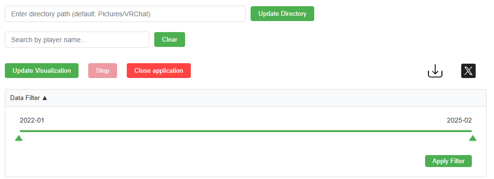

<p align='center'>
    
</p>

<div align="center">


</div>


> [!WARNING]
> Since this installer is not signed with a paid software certificate, a warning may appear when launching it.
> If you wish to proceed, click “More info” and then select “Run anyway.”

  
<!-- Shields -->
[](https://github.com/refiaa/VRChatFriendShipVisualizer/blob/master/LICENSE)
[](https://github.com/refiaa/VRChatFriendShipVisualizer/releases/latest)
[](https://github.com/refiaa/VRChatFriendShipVisualizer/stargazers)
[](https://github.com/refiaa/VRChatFriendShipVisualizer/network/members)
[](https://github.com/refiaa/VRChatFriendShipVisualizer/pulls?q=is%3Apr+is%3Aclosed)
[](https://github.com/refiaa/VRChatFriendShipVisualizer/issues?q=is%3Aissue+is%3Aclosed)


A web-based application that visualizes your VRChat friend network using interactive D3.js graphs. Easily scan your VRChat photos, generate metadata, and explore connections between players through an intuitive and dynamic interface.

Only photos taken while [**VRCX**](https://github.com/vrcx-team/VRCX) is running are supported. In addition, only photos taken with the `screenshot helper` **enabled** in VRCX can be used.

<div align="center">
  


</div>

<div align="left">

---

- [Features](#features)
- [Installation](#installation)
   - [Installation as a Standalone EXE](#installation-as-a-standalone-exe)
  - [Installation via Node.js (for dev)](#installation-via-nodejs)
- [Setup](#setup)
- [Usage](#usage)
- [Dependencies](#dependencies)
- [VirusTotal Scan](#virustotal-scan)
- [Changelog](#changelog)
- [License](#license)

## Features



- **Interactive Network Graph:** Visualize connections between VRChat players with dynamic force-directed graphs.
- **Search Functionality:** Easily search for players by name and highlight their connections.
- **Responsive Design:** Accessible and functional across various screen sizes.
- **Share and Download:** Download your network visualization as an SVG or share directly to Twitter using tmpfiles.org.
- **Date Range-based Data Filter:** Filter your images by date range using an intuitive slider.
- **EXE Installation Package:** (New) Install the application as a standalone Windows program with typical installer features (default installation folder, desktop and start menu shortcuts).

## Installation


### Installation as a Standalone EXE

For users who prefer a traditional desktop installation, a standalone EXE package is available.

1. **Download the Installer:**
   - Visit the [GitHub Releases](https://github.com/refiaa/VRChatFriendShipVisualizer/releases) page and download the latest installer (EXE).

2. **Run the Installer:**
   - Double-click the installer.
   - Follow the on-screen instructions to install the application (default installation directory is typically `C:\Program Files\VRChatFriendShipVisualizer`).
   - During installation, you can change the installation directory if desired.
   - The installer will automatically create desktop and Start Menu shortcuts.

3. **Run the Application:**
   - After installation, launch the app either from the desktop shortcut or from the Start Menu.
   - The application will run as a standalone desktop application with an embedded Express server and all features intact.


### Installation via Node.js

#### Prerequisites

Before you begin, ensure you have met the following requirements:

- **Node.js:** Install Node.js (v14 or later) from [Node.js official website](https://nodejs.org/).
- **npm:** Node.js installation includes npm. Verify installation by running:
  ```bash
  node -v
  npm -v
  ```

1. **Clone the Repository:**
   ```bash
   git clone https://github.com/refiaa/VRChatFriendShipVisualizer.git
   ```

2. **Navigate to the Project Directory:**
   ```bash
   cd VRChatFriendShipVisualizer
   ```

3. **Install Dependencies:**
   ```bash
   npm install
   ```

4. **Run the Application:**
   ```bash
   npm run dev
   ```
    - The development server will start on the configured port (default is 3000).
    - Open your browser and navigate to [http://localhost:3000](http://localhost:3000/) to view the application.

## Setup

1. **Prepare VRChat Images:**
    - By default, the application uses your VRChat image folder located at:
      ```
      C:\Users\{YourUsername}\Pictures\VRChat
      ```
    - To change the directory, use the directory configuration option in the app UI.

2. **Metadata Generation:**
    - Metadata is generated from your VRChat photos and stored in the `metadata` folder located inside your VRChat folder:
      ```
      C:\Users\{YourUsername}\Pictures\VRChat\metadata
      ```

## Usage

1. **Start the Application:**
    - For Node.js version, run `npm run dev` and navigate to [http://localhost:3000](http://localhost:3000/).
    - For the EXE version, simply launch the installed application.

2. **Update Visualization:**
    - Place your VRChat photos in the designated folder or configure a new directory.
    - Click on **Update Visualization** to generate the friend network graph.

3. **Additional Features:**
    - Use the search functionality to highlight specific nodes.
    - Filter data by date range using the slider.
    - Export the visualization as an SVG or share via Twitter.

## Dependencies

- **D3.js:** Used for dynamic, interactive network graph visualizations.
- **Express.js:** Provides a RESTful API and serves the web application.
- **Electron:** Packages the application as a standalone desktop app.
- **Additional Libraries:** form-data, fs-extra, node-fetch, and others as listed in package.json.

## VirusTotal Scan

This executable package has been scanned on [VirusTotal](https://www.virustotal.com/gui/file/f6864c0f5ca58c3448dc0800209a7fc2f6244e887dceecbffb27bec97861eb08) and is reported clean by most antivirus engines. Minor detections (e.g., Bkav Pro) are known false positives common with Electron applications.


## Changelog

See [CHANGELOG.md](CHANGELOG.md) for a list of notable changes and updates.

## License

This project is licensed under the [MIT License](LICENSE).


